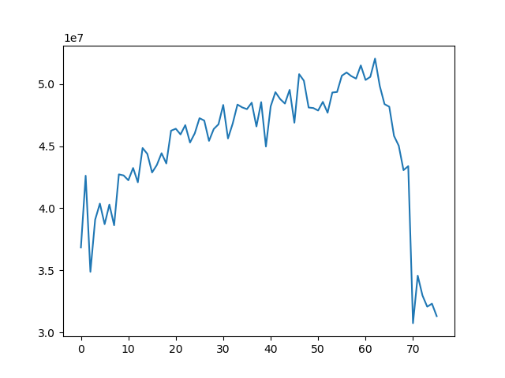
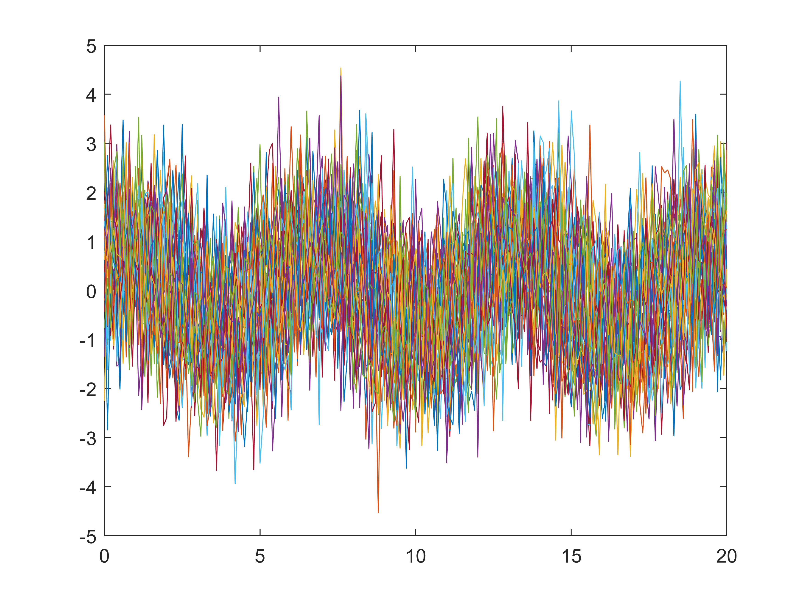
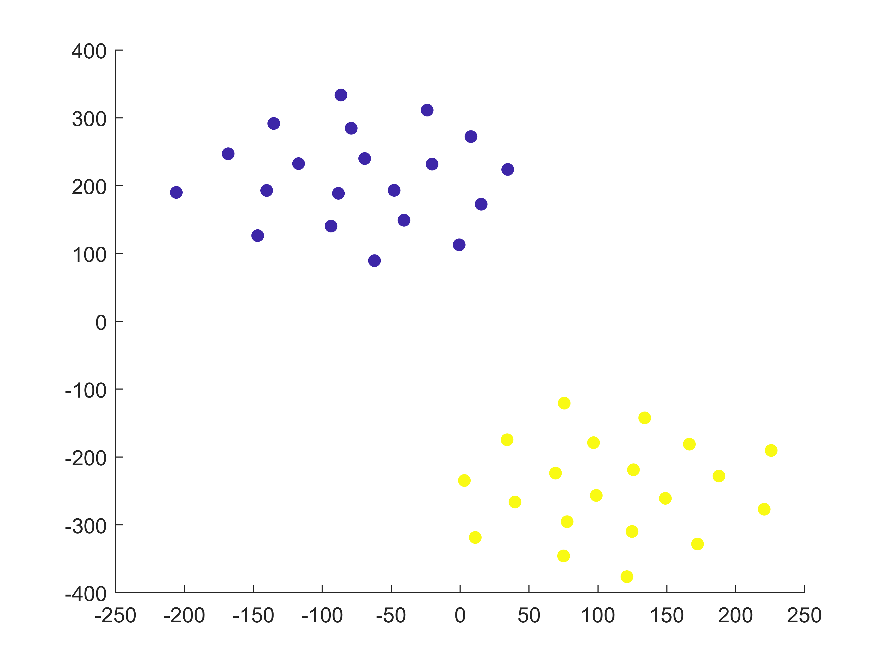
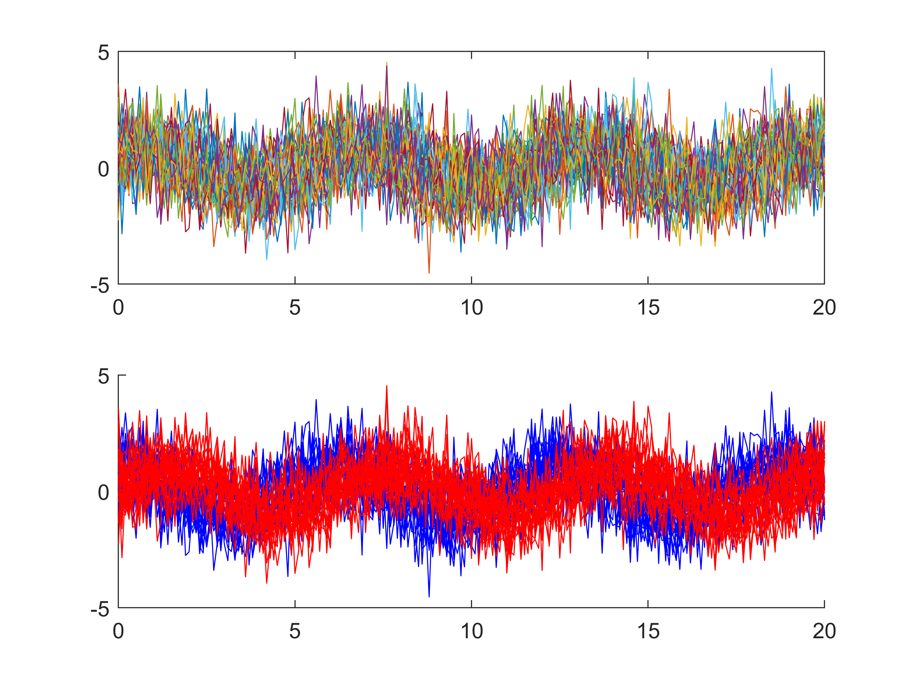
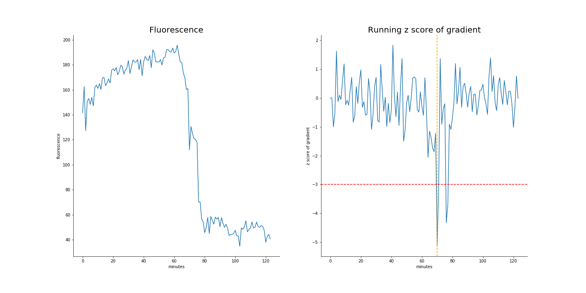
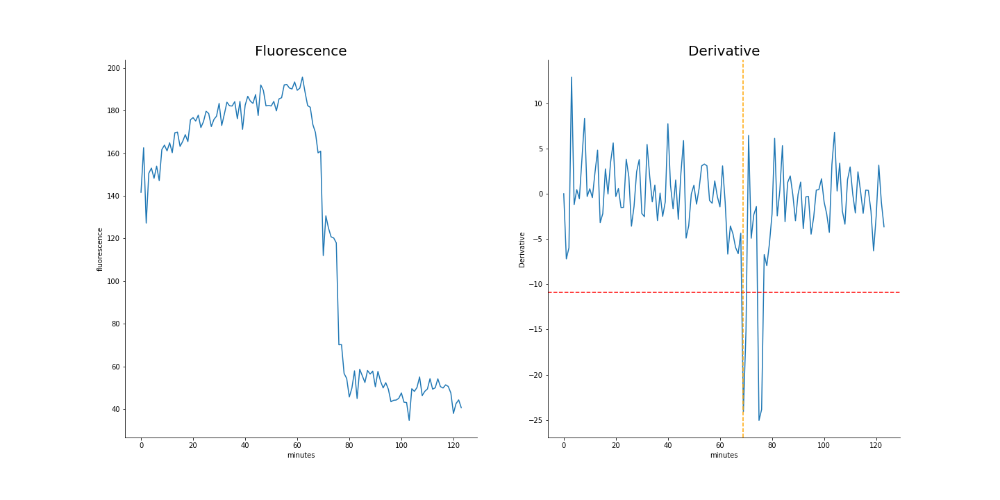

# Cells2Image
## Learning algorithm for detecting cell structure changes from light microscopy data

## Team Assignments
* Brad Busse - brad.busse@nih.gov - Team lead - Developer
* Lars Von Buchholtz - lvonbuchholtz@nidcr.nih.gov - Developer
* Patrick Fletcher - patrick.fletcher@nih.gov - Developer
* Jeremy Swan - jeremy.swan@nih.gov - Writer

## Background
In the intraerythrocytic phase of malaria infection, Merozoites enter Red Blood Cells, where they feed and multiply, condensing digested hemoglobin and waste into a vacuole in the centriom, which is observed as a dark spot in differential interference contrast (DIC) microscopy. The merozoites feed and undergo several multiplication cycles over the course of several days, before the cell reaches egress, at which point it lyses, releasing merozoites into the bloodstream to infect other cells. We want to capture high resolution images of the merozoites bursting out of red blood cells.

## Problem
The process of observing an infected Red Blood Cell for 2 days, awaiting or trying to predict a 10 minute long egress event is tedious, and not very accurate. A software tool which can predict when an infected RBC will lyse would save time and result in better science. Observing infected RBCs at high resolution requires high intensity light, which results in killing or damaging the cells, so brute force image collection at high resolution is not a solution. What is needed is an automated method to recognize pre-egress cells at a low temporal/spatial resolution and trigger high-resolution experiments.

## Current Pipeline

In order to address this problem, we developed an algorithm operating on long-duration timelapse imaging of infected RBCs in late-trophozoite or schizont stage, capturing a single optical section (2D image) every sixty seconds through egress.  We tracked the position of the infected cell with a very low threshold to capture its food vacuole and therefore position through time.  At each time point several ad hoc features were derived from the local space around the food vacuole, with the goal of capturing changes in the circularity of the cell.  Sizable changes to feature scores were detected by thresholding their derivative, indicating trigger points at which further analysis or high-resolution imaging can begin.

### Overview Chart

### Cell Mask

### Circularity

### Fluorescence

## Time Series Analysis

### Cluster Analysis

### Cluster Analysis tSNE

### Cluster Analysis Separated

## Training
In order to train our tool, we used 25 image sequences that were created by acquiring an image at low intensity once every minute through the bursting activity.

## Tools used
We used algorithms from scikit-image - Image Processing in Python. We also used Jupyter, Google Code, ImageJ 

### title

### title

### title

### title

### title

### title

