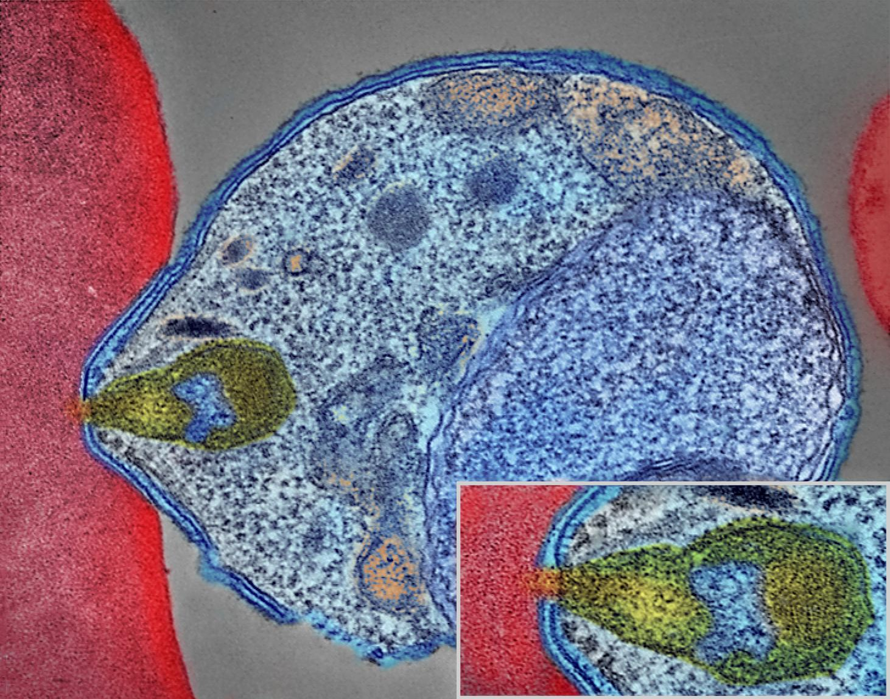
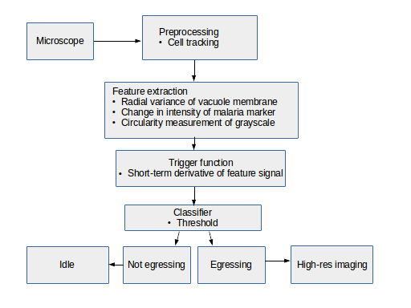
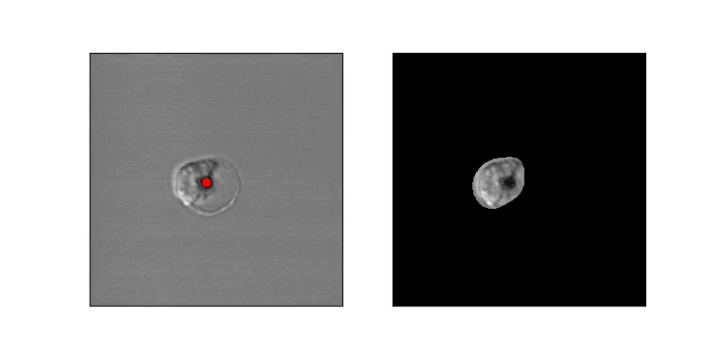
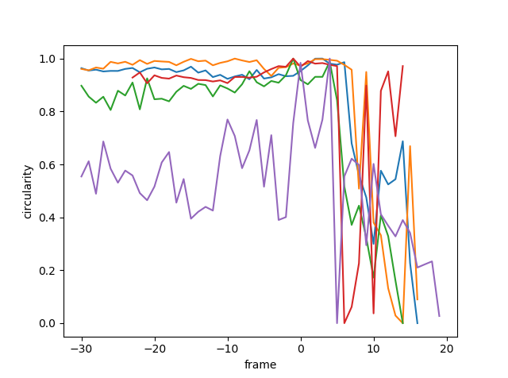
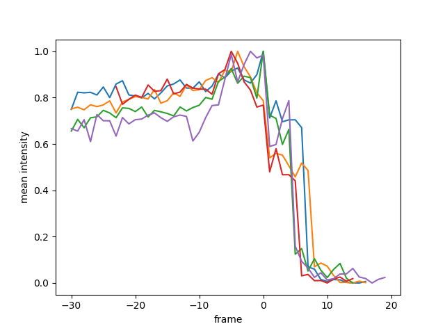
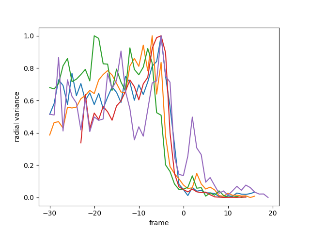
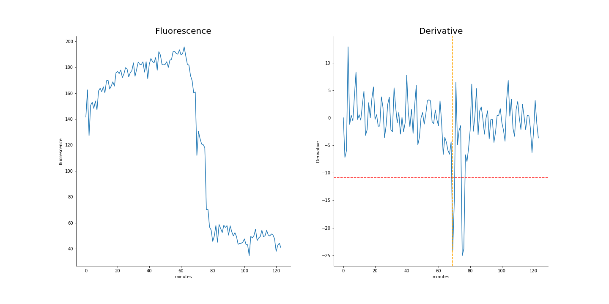

# EgreTT - a merezoite *Egre*ss *T*racking *T*ool for light microscopy studies

## Team Assignments

* Brad Busse - brad.busse@nih.gov - Team lead - Developer
* Lars Von Buchholtz - lvonbuchholtz@nidcr.nih.gov - Developer
* Patrick Fletcher - patrick.fletcher@nih.gov - Developer
* Jeremy Swan - jeremy.swan@nih.gov - Writer

## Background

In the intraerythrocytic phase of malaria infection, Merozoites enter Red Blood Cells, where they feed and multiply, condensing digested hemoglobin and waste into a vacuole in the centriom, which is observed as a dark spot in differential interference contrast (DIC) microscopy. The merozoites feed and undergo several multiplication cycles over the course of several days, before the cell reaches egress, at which point it lyses, releasing merozoites into the bloodstream to infect other cells. We want to capture high resolution images of the merozoites bursting out of red blood cells.

## Problem

The process of observing an infected Red Blood Cell for 2 days, awaiting or trying to predict a 10 minute long egress event is tedious, and not very accurate. A software tool which can predict when an infected RBC will lyse would save time and result in better science. Observing infected RBCs at high resolution requires high intensity light, which results in killing or damaging the cells, so brute force image collection at high resolution is not a solution. What is needed is an automated method to recognize pre-egress cells at a low temporal/spatial resolution and trigger high-resolution experiments.

## Current Pipeline

In order to address this problem, we developed an algorithm operating on long-duration timelapse imaging of infected RBCs in late-trophozoite or schizont stage, capturing a single optical section (2D image) every sixty seconds through egress.  We tracked the position of the infected cell with a very low threshold to capture its food vacuole and therefore position through time.  At each time point several ad hoc features were derived from the local space around the food vacuole, with the goal of capturing changes in the circularity of the cell.  Sizable changes to feature scores were detected by thresholding their derivative, indicating trigger points at which further analysis or high-resolution imaging can begin.

### Overview Chart

### Cell Mask

### Circularity

In order to estimate parasite circularity directly, we derived a mask of the parasite-filled vacuole using a process of mean subtraction, taking the absolute value, gaussian blurring, thresholding, and finally selecting the proper region according to prior positioning.  The ratio of the parasite's area to its perimeter (4*pi*area/perimeter^2) is a measurement of the region's circularity.

### Fluorescence

The most direct of our tested features is the mean fluorescence of the vacuole mask.  The point of vacuole rupture brings with it a noticeable drop in fluorescence, which proved to be a reliably detectable, albeit slightly late marker.

### Radial Variance

Another feature of infected cells in the time period before egress is a retraction of EXP2 signalling (green channel) to the periphery of the parasite vacuole.  This could be observed by conducting a radial analysis outward from the food vacuole.  As the EXP2 retracts and the vacuole rounds, the radial variance drops sharply and measurably.

### Derivative-based trigger scheme

## Tools used

We used algorithms from scikit-image - Image Processing in Python. We also used Jupyter, Google Code, ImageJ 
